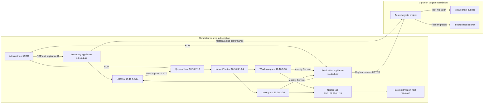
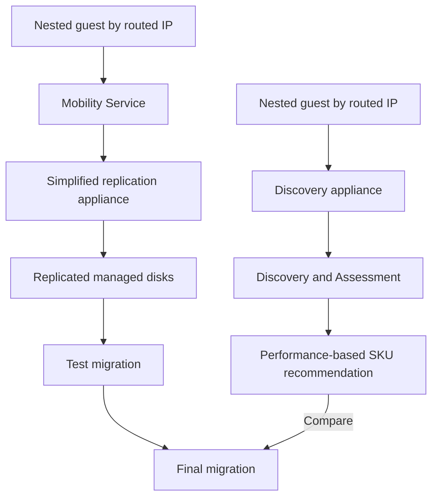

# Azure Migrate Physical-Server Simulation Lab

This repository provisions a two-subscription Azure lab for learning Azure Migrate physical/other-cloud discovery, assessment, and simplified agent-based migration. Azure hosts the lab infrastructure, while the source workloads run as ordinary nested Hyper-V guests so that they are discovered and migrated as physical or other servers rather than as Azure virtual machines.

> **Lab disclaimer**
>
> This lab uses nested virtualization in Azure to simulate physical or other-cloud servers.
>
> The nested guests and routing arrangement are for testing and education. They are not a production source topology or a statement of support for nested virtualization in production migrations.
>
> It should not be interpreted as demonstrating Azure-to-Azure migration through Azure Migrate as a supported production migration architecture.
>
> The objective is to reproduce and understand the Azure Migrate discovery, assessment, Mobility Service, agent-based replication, test migration, and migration workflows normally associated with physical servers and servers running in other environments.

## Lab Boundary

The two source machines are installed from ordinary Windows and Ubuntu media inside Hyper-V. They do not have Azure VM Agent, Azure Instance Metadata Service (IMDS) is blocked, and they should not identify as Azure VMs. This removes the former direct-Azure Marketplace-disk limitation from the expected lab path. Azure Migrate and Site Recovery support requirements still apply to the guest operating system, kernel, credentials, network connectivity, and Mobility Service version.

## Architecture



Discovery and migration remain separate workflows.



## What Bicep Creates

| Subscription | Automated resources |
| --- | --- |
| Simulated source | Resource group, segmented VNet, NSGs, route table, NAT Gateway, public IPs for the discovery, replication, and Hyper-V VMs, discovery appliance VM, simplified replication appliance VM, Windows Server 2022 Hyper-V host with IP forwarding and a 512-GB guest disk, nested Windows and Linux guests, sample IIS/Nginx workloads, and shutdown schedules for the three Azure VMs |
| Migration target | Resource group, target VNet, isolated test/final subnets, NSGs, optional NAT Gateway, and optionally a full Azure Migrate hub project with server assessment, discovery, and migration solutions |

The root deployment accepts both subscription IDs and deploys subscription-scoped modules to each subscription. The VNets are intentionally not peered.

The source network is deliberately split:

| Component | Address or prefix | Purpose |
| --- | --- | --- |
| Discovery appliance | `10.10.1.10` | Physical/other-server discovery and assessment |
| Replication appliance | `10.10.1.20` | Mobility Service push and replication |
| Hyper-V host | `10.10.2.10` | Azure VM with Standard security, NIC IP forwarding, and CIDR-restricted public RDP |
| `NestedRouted` switch | `10.10.3.1/24` | Appliance-to-guest discovery and replication path |
| `source-win01` | Routed `10.10.3.10`; NAT `192.168.250.10` | Nested Windows Server source |
| `source-linux01` | Routed `10.10.3.20`; NAT `192.168.250.20` | Nested Ubuntu source |
| `NestedNat` switch | `192.168.250.1/24` | Guest outbound path through host WinNAT |

The appliance subnet has a user-defined route for `10.10.3.0/24` with next hop `10.10.2.10`. The host forwards traffic to `NestedRouted`; guest internet traffic uses the separate `NestedNat` adapters and host WinNAT. IMDS at `169.254.169.254` is blocked in both guests.

## Manual Azure Migrate Steps

The following remain guided checkpoints because they use portal-generated artifacts, runtime credentials, or interactive workflows:

- Appliance registration and interactive Microsoft Entra authentication
- Obtaining project or replication appliance keys
- Entering discovery and Mobility Service credentials
- Installing Mobility Service through supported push or manual installation
- Creating assessments and choosing assessment settings
- Enabling and monitoring replication
- Test migration, test cleanup, final migration, and completion

## Prerequisites

- One Microsoft Entra tenant containing two Azure subscriptions
- Permission to create subscription deployments and resource groups in both subscriptions
- Azure Migrate Owner or a higher role in the target subscription for project creation
- Current Azure CLI with Bicep support
- Source quota for at least 40 vCPUs across the relevant regional and VM-family quotas
- Target quota for the initial 4-vCPU migrated-workload assumption
- A public administrator IPv4 CIDR, preferably one `/32`

The default appliances use:

- Discovery: `Standard_D8as_v7`, 8 vCPUs and 32 GB RAM
- Replication: `Standard_D16as_v7`, 8 physical cores/16 vCPUs and 64 GB RAM, plus a 640-GB cache disk
- Nested Hyper-V host: `Standard_D16as_v7`, 16 vCPUs and 64 GB RAM, Standard security, IP forwarding, and a 512-GB guest disk

The deployment validates the configured profile and supported fallback profiles against nested-virtualization support, SKU restrictions, regional quota, and family quota. A validated equivalent host can replace `Standard_D16as_v7` when the default is unavailable.

## Configure and Deploy

### Run the resumable setup

The primary workflow deploys infrastructure, prepares the nested guests, verifies the Azure Migrate project, installs both appliances, pauses at the required portal/configuration checkpoints, and runs end-to-end validation:

`pwsh -NoProfile -ExecutionPolicy Bypass -File .\scripts\setup-lab.ps1`

To pre-approve resource creation and skip typing `DEPLOY` after what-if:

`pwsh -NoProfile -ExecutionPolicy Bypass -File .\scripts\setup-lab.ps1 -ApproveDeployment`

Select regions explicitly when needed:

`pwsh -NoProfile -ExecutionPolicy Bypass -File .\scripts\setup-lab.ps1 -SourceLocation eastus2 -TargetLocation westus2 -ApproveDeployment`

This switch bypasses only the final deployment confirmation. Password acknowledgements and Microsoft appliance registration checkpoints remain interactive.

Step 1 displays a one-time deployment password for the three Azure Windows VMs: the discovery appliance, replication appliance, and Hyper-V host. Step 2 displays a different one-time 24-character alphanumeric nested guest password. Both guest `labadmin` accounts and Linux `root` use the nested guest password. The deployment password is never used for nested guest discovery or replication credentials.

Progress is stored in the Git-ignored
`scripts/setup-lab.state.local.json` file. The state contains only step names,
statuses, timestamps, and diagnostic text. It does not contain passwords,
registration keys, project keys, or source credentials.

Manual checkpoints use numbered actions, aligned credential/source tables,
short notes, and a dedicated confirmation block so values are easy to scan and
copy. Azure project verification retries transient ARM failures such as 429,
timeouts, `InternalServerError`, and HTTP 5xx up to four attempts with bounded
exponential backoff; permanent authorization and validation failures stop
immediately.

Inspect or resume at a specific stage:

```powershell
pwsh -NoProfile -ExecutionPolicy Bypass -File .\scripts\setup-lab.ps1 -Status
pwsh -NoProfile -ExecutionPolicy Bypass -File .\scripts\setup-lab.ps1 -FromStep PrepareNestedGuests
```

The resumable step names are:

1. `DeployInfrastructure`
2. `PrepareNestedGuests`
3. `VerifyProject`
4. `InstallDiscovery`
5. `RegisterDiscovery`
6. `CreateMigrationResources`
7. `InstallReplication`
8. `RegisterReplication`
9. `ValidateLab`

Use `-ResetState` to discard local workflow progress after typing `RESET`.
Completed Azure resources are not deleted or changed by that option.

The guided [deployment script](scripts/deploy-lab.ps1) asks for every parameter. Required values have no default; optional values display their current default and accept it when you press **Enter**.

### Run the guided deployment

Open PowerShell in the repository root. You may sign in first:

`az login`

This is optional. The deployment script automatically runs `az login` if the current Azure CLI session is not authenticated.

Run the deployment:

`pwsh -NoProfile -ExecutionPolicy Bypass -File .\scripts\deploy-lab.ps1`

On the first run, the script saves all non-secret answers to `scripts/deploy-lab.local.json`. Later runs display the loaded settings and prompt you to use them, change them, or quit before generating the temporary Windows administrator password.

The script performs this complete flow:

1. Asks for source and target subscription IDs.
2. Asks for the administrator CIDR.
3. Prompts independently for source and target regions, resource prefix, administrator name, appliance sizes, Hyper-V host size, and target sizing assumptions.
4. Prompts for shutdown, target NAT Gateway, and Azure Migrate project options with defaults.
5. Generates an Azure-compatible 24-character deployment password for the Azure appliances and host, displays it once, and waits for `READY` after you store it securely.
6. Signs in to Azure, registers `Microsoft.Compute/UseStandardSecurityType` in the source subscription, propagates it through the Compute provider, and registers other required providers that are not already registered.
7. Evaluates configured VM sizes and supported fallback profiles; it selects the first profile that passes capability, SKU, and quota checks in both selected regions unless sizes were explicitly overridden.
8. Prints timestamped details for providers, each VM SKU/capability/family, regional quota, family quota, Bicep compilation, ARM validation, and what-if.
9. Compiles Bicep and runs Azure Resource Manager validation to catch policy and template constraints.
10. Displays the full what-if preview.
11. Shows an action banner after the what-if summary and waits until you type `DEPLOY` or `CANCEL` exactly. Pressing **Enter** alone re-prompts without changing resources.
12. Prints an ARM operation summary with the provisioning state of each deployed module/resource.
13. Classifies nested ARM failures and offers validated region or equivalent-SKU recovery for quota/capacity failures.
14. Clears the password and all temporary lab environment variables before exiting.

After deployment, setup step 2 installs Hyper-V and routing, displays the separate nested guest password once, downloads installation media, and provisions both guests.

Example prompts:

```text
Simulated source Azure region [eastus2]:
Migration target and Azure Migrate region [westus2]:
Discovery appliance VM size [Standard_D8as_v7]:
Nested Hyper-V host VM size [Standard_D16as_v7]:
Enable automatic VM shutdown [Y/n]:
Deploy target NAT Gateway [y/N]:
```

Press **Enter** to accept any value shown in brackets.

### Prepare the Hyper-V host and nested guests

`setup-lab.ps1` runs this automatically as `PrepareNestedGuests`. To run the stage independently:

```powershell
pwsh -NoProfile -ExecutionPolicy Bypass `
    -File .\scripts\prepare-hyperv-host.ps1 `
    -ConfigFile .\scripts\deploy-lab.local.json `
    -DeploymentName azure-migrate-lab
```

The public defaults are the Microsoft Windows Server 2022 Evaluation fwlink, Canonical's pinned generic Ubuntu 22.04 cloud image, and a pinned Windows qemu-img package. The worker converts the generic qcow2 image to dynamic VHDX, then first-boot customization uses a NoCloud CIDATA disk. This avoids both interactive Ubuntu installer prompts and the Azure-specific image's Azure datasource dependency. Override the HTTPS URIs when a public endpoint changes or an approved mirror is required:

```powershell
pwsh -NoProfile -ExecutionPolicy Bypass `
    -File .\scripts\prepare-hyperv-host.ps1 `
    -WindowsServerIsoUri '<https-windows-iso-uri>' `
    -UbuntuCloudImageUri '<https-ubuntu-qcow2-image-uri>' `
    -QemuImgArchiveUri '<https-qemu-img-zip-uri>' `
    -WindowsServerIsoSha256 '<optional-64-hex-sha256>' `
    -UbuntuCloudImageSha256 '<64-hex-sha256>' `
    -QemuImgArchiveSha256 '<64-hex-sha256>'
```

`-UbuntuVhdArchiveUri` and `-UbuntuVhdArchiveSha256` remain aliases for compatibility. The pinned Ubuntu and qemu-img defaults include SHA256 values. Public download URLs and redirect targets can drift; verify the publisher, expected media or tool version, licensing terms, and hash before using a changed URL. Windows Server Evaluation is time-limited evaluation software and must be used according to Microsoft's evaluation license; it is not a production license.

The script returns immediately when the host status is already `Ready`. Use `-Force` to rebuild after reviewing the current host state; it can recreate nested guest artifacts. Provisioning runs as a scheduled task on the host and the caller polls for up to eight hours by default; override the bounded wait with `-ProvisioningTimeoutHours` when needed.

Public media and tool downloads use native `curl.exe` with redirect handling, retries, stall detection, and HTTP range resume. Interrupted `.partial` files are retained, so a later non-`Force` run continues instead of restarting the Windows ISO, Ubuntu cloud image, or qemu-img package download.

While provisioning runs, the console refreshes every 30 seconds with the current phase, scheduled-task state and last result, cached or partial media sizes, and both nested VM states. Long phases are reported separately for Windows and Ubuntu downloads, Windows media validation and image application, Linux qcow2-to-VHDX conversion, guest startup, and endpoint readiness probes.

### Install the discovery appliance software

After the infrastructure deployment succeeds, run the second-stage installer:

`pwsh -NoProfile -ExecutionPolicy Bypass -File .\scripts\install-discovery-appliance.ps1`

The script reads `scripts/deploy-lab.local.json` and the `azure-migrate-lab`
subscription deployment outputs to locate the discovery VM. It uses Azure VM
Run Command, so it does not expose WinRM or transport the VM administrator
password. On the discovery VM it:

1. Downloads the physical discovery appliance package from Microsoft's HTTPS
    download endpoint.
2. Requires the pinned package SHA256 and valid Microsoft Authenticode
    signatures on the PowerShell files.
3. Runs `AzureMigrateInstaller.ps1` with the `Physical`, `Public`, and public
    endpoint options supplied noninteractively.
4. Verifies the appliance registry state, IIS, and the Configuration Manager
    listener on TCP 44368.
5. Applies pinned Microsoft Configuration Manager and Auto Update component
    MSIs after validating SHA256 and Authenticode signatures.
6. Tests TCP 44368 from the administrator workstation and prints the remaining
    registration steps.

The package hash is intentionally pinned. If Microsoft publishes a new package,
the script fails before execution. Verify the new hash from an official source,
then pass it explicitly:

`pwsh -NoProfile -ExecutionPolicy Bypass -File .\scripts\install-discovery-appliance.ps1 -ExpectedSha256 '<verified-sha256>'`

A healthy existing installation is skipped. Use `-Force` only to repair an
installation after reviewing logs under `C:\AzureMigrateSetup` on the VM. Use
`-SkipExternalReachabilityCheck` when the workstation cannot directly test the
public appliance endpoint.

The script stops before registration. Generate the physical discovery project
key in Azure Migrate, open `https://<discovery-public-ip>:44368`, paste the key,
install updates, and complete device-code authentication. Project keys and
credentials are never supplied to the script or stored in the repository.

#### Generate the project key

1. Open the Azure Migrate project and stay on **Overview**.
2. Under **Inventory**, select **Start discovery**.
3. Select **Using appliance**, then choose **Physical or other (AWS, GCP, Xen, etc.)**.
4. Enter an alphanumeric appliance name of 14 characters or fewer, select **Generate key**, and copy the generated project key.

#### Register the appliance

1. Open `https://<discovery-public-ip>:44368` and sign in with an administrator account from the discovery appliance VM when prompted by the browser.
2. Accept the license terms and complete the connectivity and time-sync checks.
3. Paste the project key and wait for appliance updates to complete.
4. Select **Login** > **Copy code & Login**, complete device-code sign-in, and confirm registration under **View details**.

#### Add credentials

- Add `labwindows` as **Windows Server**, using local user `labadmin` and the nested guest password displayed in step 2.
- Add `lablinux` as **Linux password**, using local user `labadmin` and the same nested guest password.

Friendly names cannot contain `-`. Credentials remain encrypted on the appliance and are not stored by the setup scripts.

#### Add servers

| OS | VM | Private IP | Credential |
| --- | --- | --- | --- |
| Windows | `source-win01` | `10.10.3.10` | `labwindows` |
| Linux | `source-linux01` | `10.10.3.20` | `lablinux` |

1. Under **Provide physical or virtual server details**, add both rows above.
2. Save and wait for both connection validations to pass.
3. Select **Start discovery**.
4. Wait for **Discovery has been successfully initiated**.
5. Return to `setup-lab.ps1` and enter `DISCOVERY REGISTERED`.

If the prerequisite checker reports `401 Unauthorized` for
`https://graph.windows.net/`, the appliance reached the Microsoft endpoint; a
401 is an unauthenticated application response, not a DNS, NAT, or firewall
failure. The installer updates Configuration Manager and Auto Update from
Microsoft's `https://aka.ms/latestapplianceservices` manifest metadata. Refresh
the browser and rerun prerequisites after an update; restart the appliance when
Windows reports pending file replacements. Use `-SkipComponentUpdates` only for
diagnosis when retaining the installed versions is intentional.

#### Generate the replication appliance key

1. In the Azure Migrate project, open **Execute** > **Migrations**.
2. If prompted, select **Enable MSI**, wait for completion, and select **Reload**. New deployments enable MSI through Bicep. Do not switch to the classic experience.
3. Select **Start execution**.
4. Select **Servers or virtual machines (VMs)** > **Azure VM** > **From all inventory**.
5. Select the registered **Physical** discovery appliance.
6. In the red **No replication appliance is registered to this project** message, select **Click here to set up**.
7. Verify **Target region** matches `TargetLocation` (`West US 2` by default). Stop if another region is displayed.
8. Select **Generate key**, wait for the key, and copy it to secure temporary storage.
9. Return to `setup-lab.ps1` and enter `MIGRATION KEY GENERATED`.

Enabling MSI adds a system-assigned managed identity to the Azure Migrate
project for secure migration tracking. The portal provisions the Recovery
Services vault before displaying the key-generation page. The generated key is
pasted into the replication appliance during its registration step. The target
region cannot be changed for subsequent migrations in this project.

### Install the simplified replication appliance software

After the infrastructure deployment succeeds, run the separate replication
installer:

`pwsh -NoProfile -ExecutionPolicy Bypass -File .\scripts\install-replication-appliance.ps1 -ConfigFile .\scripts\deploy-lab.local.json`

The script locates the dedicated replication VM from the deployment outputs
and uses Azure VM Run Command. It verifies the Windows Server version and
locale, CPU/RAM, the 640-GB `E:` cache volume, static private IP, prohibited
roles, FIPS and group policies, pending reboot state, Microsoft Edge, and OS
disk free space.

The simplified appliance package is approximately 4 GB. The script downloads
it from Microsoft's official endpoint with `curl.exe`, requires the pinned
SHA256 and valid Microsoft Authenticode signatures, and reuses a cached package
only when its hash still matches. It then runs the signed `DRInstaller.ps1`,
verifies the local configuration manager, and reports detected appliance
products. Azure registration remains outside the script.

A normal run checks before downloading and reports `AlreadyInstalled` when the
appliance is healthy. A partial installation reports its state without changing
it; use `-Force` only after reviewing logs under
`C:\AzureMigrateReplicationSetup`. If installation requires a restart, the
script asks you to type `RESTART`, restarts the VM through Azure CLI, and resumes
health checks when the VM Agent returns.

No replication configuration-manager port is exposed publicly. RDP to the
replication VM through the existing CIDR-restricted rule, open Microsoft Azure
Appliance Configuration Manager locally, and choose **FQDN** connectivity. Keep
the detected `amig-repl` name and TCP port `9443`, select **Save**, and then
select **Continue**. Do not choose **NAT IP**: the source machines reach the
appliance over the private routed path through the Hyper-V host, and the public
IP is for RDP only.
This connectivity choice cannot be changed after it is saved. Enter the
portal-generated simplified replication appliance key and complete device-code
authentication. The discovery inventory can be selected for assessment and
sizing, but guest credentials are not transferred between appliances. Add
`source-win01` at `10.10.3.10` with `labwindows` (`labadmin`) and
`source-linux01` at `10.10.3.20` with `lablinuxroot` (`root`), both using the
one-time nested guest password displayed in step 2. The replication source
subnet is `10.10.3.0/24`; appliance traffic follows the UDR through Hyper-V host
`10.10.2.10`. The Windows firewall allows the appliance paths required for
WinRM, WMI/DCOM, and push installation. Linux enables password-based SSH and
SFTP for the appliance. Registration keys and source credentials are never
stored by the scripts.

After the configurator reports successful completion, refresh Azure Migrate and
open **Migration and modernization > Infrastructure servers > Configuration
servers**. Step 7 verifies the authoritative connected Site Recovery provider
and prints its fabric health and heartbeat; it does not rely on a local registry
flag or expect the provider in the discovery-appliance inventory.

Before enabling replication, nested guest provisioning prepares source
push-install requirements. Windows allows WMI/DCOM dynamic RPC TCP
`49152-65535` only from the replication appliance path. Linux is installed from
Ubuntu 22.04.5 media and prepared for root/password SSH plus SFTP. Recheck
Microsoft's current operating-system and kernel support matrix whenever the
Mobility Service version or guest kernel changes.

### Saved settings

The local cache includes subscription IDs, administrator CIDR, regions, names, VM sizes, shutdown settings, and deployment toggles. It never stores the Azure deployment password or the nested guest password.

When cached settings are loaded, choose **Use** (the default) to continue, **Change** to re-enter every setting with its current value preloaded as the default, or **Quit** to exit before any Azure operation. The confirmed values are then saved for the next run.

The cache is ignored by Git. To discard it and answer every prompt again:

`pwsh -NoProfile -ExecutionPolicy Bypass -File .\scripts\deploy-lab.ps1 -Reconfigure`

Explicit command-line parameters override cached values and are saved for the next run. To use another cache file:

`pwsh -NoProfile -ExecutionPolicy Bypass -File .\scripts\deploy-lab.ps1 -ConfigFile '.\scripts\my-lab.local.json'`

Review or reconfigure the cached administrator CIDR whenever your public IP address changes.

The source and target regions are independent. Source appliances and simulated workloads default to `eastus2`; target networking, Azure Migrate metadata, and migration resources default to supported region `westus2`. Override them with `-SourceLocation` and `-TargetLocation`.

Preflight registers the `Microsoft.Compute/UseStandardSecurityType` feature required by the Standard-security Hyper-V host, re-registers `Microsoft.Compute` to propagate it, and registers the other required source and target resource providers before checking availability. Feature registration requires `Microsoft.Features/*` permission. It rejects unsupported Azure Migrate target regions and checks subscription-aware SKU restrictions plus regional and VM-family quota for the three source-side Azure VMs: discovery appliance, replication appliance, and Hyper-V host. The default source requirement is 40 vCPUs. The two intended migrated workload sizes are a 4-vCPU target assumption; target capacity is re-evaluated when migration starts because no target workload VMs are allocated during lab infrastructure deployment.

Automatic VM-size selection is enabled by default when no VM-size command-line
arguments are supplied and sizes were not edited interactively. The selected
profile is written to the non-secret local configuration for reproducible
reruns. Supply explicit size parameters to keep them authoritative, or use
`-AutoSelectVmSizes:$false` to validate configured values without substitution.

The script uses `az vm list-skus --all` to reject `QuotaId` and `NotAvailableForSubscription` restrictions. It derives the VM family from Azure SKU metadata and checks both total regional and family-specific vCPU quota. When the selected region passes, it is reported as the default recommendation for the selected sizes.

Quota and SKU checks cannot guarantee transient Azure host capacity because capacity is allocated during deployment. ARM validation and what-if are additional gates; only an on-demand capacity reservation guarantees VM capacity.

For quota, SKU restriction, or capacity failures, the script first tests every candidate region in the same Azure geography and ranks eligible options by the tightest regional or VM-family quota headroom. It tries the current sizes before allowlisted Dasv7, Dasv6, and Dasv5 profiles that meet appliance CPU/RAM minimums. Only when no same-geography option is eligible does it repeat the search across other Azure geographies. Up to three candidates must pass SKU, quota, ARM validation, and what-if checks before they are presented. The script changes and caches settings only after you select an option.

If a failed deployment already created deterministic resource groups, in-place recovery is restricted to equivalent SKUs in the current region. Cross-region options require a new `-NamePrefix` or explicit resource-group cleanup. The script never deletes resource groups automatically.

When Windows VMs from a partial deployment already exist, the script lists them and requires typing `ROTATE` before it aligns their administrator password after a successful incremental deployment.

After deployment approval and before Bicep changes, the script removes a stale Defender for Cloud JIT policy only when every VM in that policy belongs to this lab. It refuses cleanup when a non-lab VM is present. Bicep then restores the administrator-CIDR-restricted management rules, preventing an expired JIT window from unexpectedly blocking RDP on a resumed deployment.

Run the local regression checks without contacting Azure:

`pwsh -NoProfile -ExecutionPolicy Bypass -File .\scripts\tests\deploy-lab.tests.ps1`

`pwsh -NoProfile -ExecutionPolicy Bypass -File .\scripts\tests\install-discovery-appliance.tests.ps1`

`pwsh -NoProfile -ExecutionPolicy Bypass -File .\scripts\tests\install-replication-appliance.tests.ps1`

`pwsh -NoProfile -ExecutionPolicy Bypass -File .\scripts\tests\verify-migrate-project.tests.ps1`

`pwsh -NoProfile -ExecutionPolicy Bypass -File .\scripts\tests\setup-lab.tests.ps1`

`pwsh -NoProfile -ExecutionPolicy Bypass -File .\scripts\tests\test-lab.tests.ps1`

`pwsh -NoProfile -ExecutionPolicy Bypass -File .\scripts\tests\remove-lab.tests.ps1`

`pwsh -NoProfile -ExecutionPolicy Bypass -File .\scripts\tests\nested-hyperv.tests.ps1`

### Preview only

To run all validation and stop after what-if without deploying resources:

`pwsh -NoProfile -ExecutionPolicy Bypass -File .\scripts\deploy-lab.ps1 -WhatIfOnly`

### Non-interactive optional parameters

Every prompt can also be supplied as a PowerShell parameter. For example:

`pwsh -NoProfile -ExecutionPolicy Bypass -File .\scripts\deploy-lab.ps1 -SourceLocation eastus2 -TargetLocation westus2 -WindowsSourceVmSize Standard_D2as_v7 -WhatIfOnly`

Passwords, appliance keys, registration keys, and project keys are never written to the repository.

### Verify and remove the lab

Run the full live validation independently after registration:

`pwsh -NoProfile -ExecutionPolicy Bypass -File .\scripts\test-lab.ps1`

Use `-SkipGuestChecks` for a faster control-plane-only pass. The full pass checks
deployment outputs, resource groups, subnets, all three source-side Azure VMs
and disks, project solutions, linked migration resources, appliance
health/registration, and the nested Windows and Linux sample workloads. Azure
Run Command on the discovery appliance verifies its routed WinRM and SSH paths
to the guests. A separate probe on the Hyper-V host checks both VMs, both
internal switches, routed-interface forwarding, guest NICs, and IIS/Nginx
content. Azure Run Command is never invoked against the nested guests because
they have no Azure VM Agent.

Preview guarded cleanup before deleting anything:

```powershell
pwsh -NoProfile -ExecutionPolicy Bypass -File .\scripts\remove-lab.ps1 -WhatIf
pwsh -NoProfile -ExecutionPolicy Bypass -File .\scripts\remove-lab.ps1 -IncludeLinkedMigrationResources
pwsh -NoProfile -ExecutionPolicy Bypass -File .\scripts\remove-lab.ps1 -IncludeLinkedMigrationResources -ResetLocalState
```

Cleanup inventories exact deployment output IDs, never uses a broad resource
group prefix, explicitly rejects `NetworkWatcherRG`, and requires `DELETE LAB`.
Linked vault/storage resources outside the lab target resource group are included
only with `-IncludeLinkedMigrationResources` and only when the project solution
metadata exposes their ARM IDs. After resource deletion, cleanup also removes
the exact root, nested source/target, validation, and preview subscription
deployment-history records. Use `-KeepDeploymentHistory` to retain those records.
Use `-ResetLocalState` for a fresh start; after Azure cleanup it also removes
`setup-lab.state.local.json`, `deploy-lab.local.json`, and generated `infra/main.json`.

Active replication and every test migration must be cleaned up before resource
deletion. Deleting the source resource group deletes the Hyper-V host and its
512-GB guest disk, which also deletes both nested guest VHDXs.

## Next Steps

Follow the [complete lab guide](docs/lab-guide.md), then record sizing observations in the [assessment-versus-migration experiment](docs/sizing-experiment.md).

## References

- [Azure Migrate appliance](https://learn.microsoft.com/azure/migrate/migrate-appliance)
- [Create an Azure Migrate project quickstart template](https://github.com/Azure/azure-quickstart-templates/tree/master/quickstarts/microsoft.migrate/migrate-project-create)
- [Physical server discovery support matrix](https://learn.microsoft.com/azure/migrate/migrate-support-matrix-physical)
- [Discover physical servers](https://learn.microsoft.com/azure/migrate/tutorial-discover-physical)
- [Simplified agent-based migration experience](https://learn.microsoft.com/azure/migrate/simplified-experience-for-azure-migrate)
- [Migrate machines as physical servers](https://learn.microsoft.com/azure/migrate/tutorial-migrate-physical-virtual-machines)
- [Modernized replication appliance requirements](https://learn.microsoft.com/azure/site-recovery/replication-appliance-support-matrix)